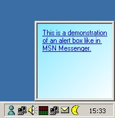



## MSN Messenger Alert Box

### Description

This project demonstrates you how to build an alert box like MSN Messenger has. It is displayed in the bottom-right corner of your screen. When an alert is shown while another one is still visible, it is placed on top of the existing box.

By moving the mousecursor over the text it appears as a hyperlink. And to get a little bit of the Microsoft feeling I've added a simple gradient found elsewhere on PSC.
 
### More Info
 

             |
---                |---
**Submitted On**   |2002-02-27 15:34:42
**By**             |[Robin Schuil](https://github.com/Planet-Source-Code/PSCIndex/blob/master/ByAuthor/robin-schuil.md)
**Level**          |Intermediate
**User Rating**    |4.6 (73 globes from 16 users)
**Compatibility**  |VB 3\.0, VB 4\.0 \(16\-bit\), VB 4\.0 \(32\-bit\), VB 5\.0, VB 6\.0
**Category**       |[Custom Controls/ Forms/  Menus](https://github.com/Planet-Source-Code/PSCIndex/blob/master/ByCategory/custom-controls-forms-menus__1-4.md)
**World**          |[Visual Basic](https://github.com/Planet-Source-Code/PSCIndex/blob/master/ByWorld/visual-basic.md)
**Archive File**   |[MSN\_Messen579822272002\.zip](https://github.com/Planet-Source-Code/robin-schuil-msn-messenger-alert-box__1-32151/archive/master.zip)

